# Cobalt2 Theme

> A Cobalt2 theme for VS Code entirely based on [Cobalt2 from Wes Bos](https://github.com/wesbos/cobalt2).

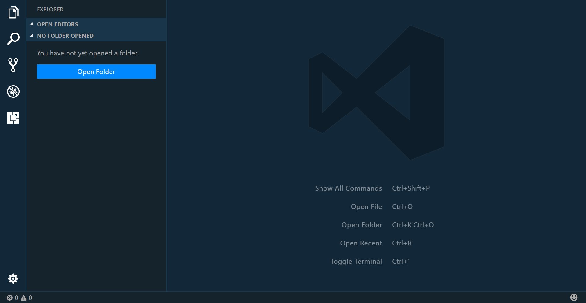

# Installation

1. Install [Visual Studio Code](https://code.visualstudio.com/)
2. Launch Visual Studio Code
3. Choose **Extensions** from menu
4. Search for `vscode-theme-cobalt2`
5. Click **Install** to install it
6. Click **Reload** to reload the Code
7. File > Preferences > Color Theme > **Cobalt2**

# Editor Features

## Activity Bar


## Debug

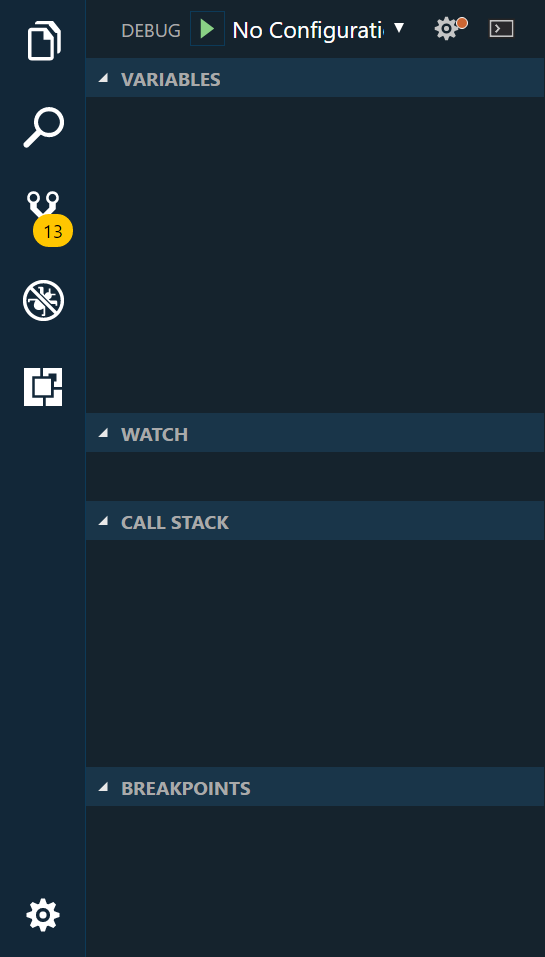

## Extensions

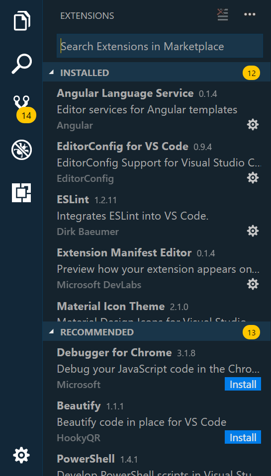

## Notifications


## Search

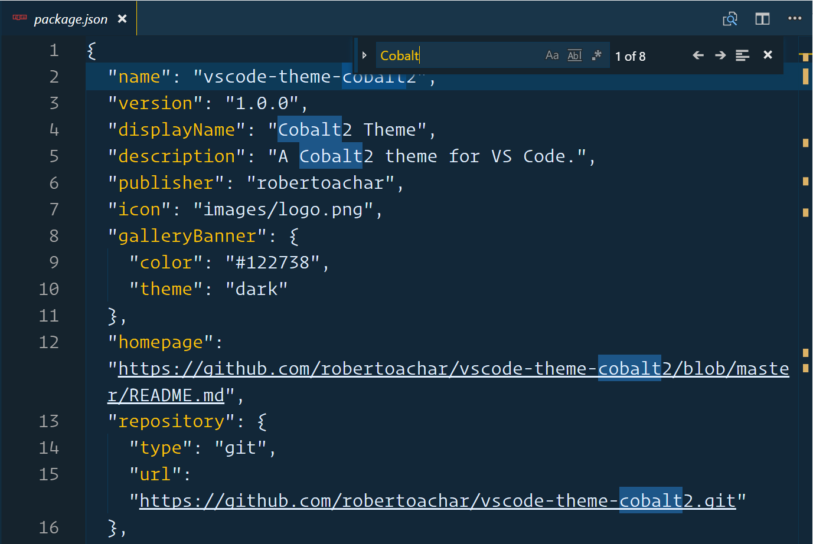

## Sidebar


## Status Bar


## Tabs


# Languages

## CSS

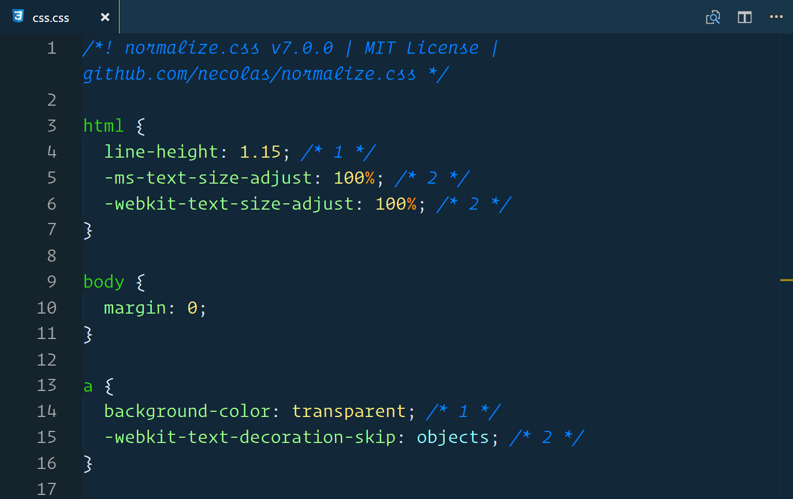

## HTML

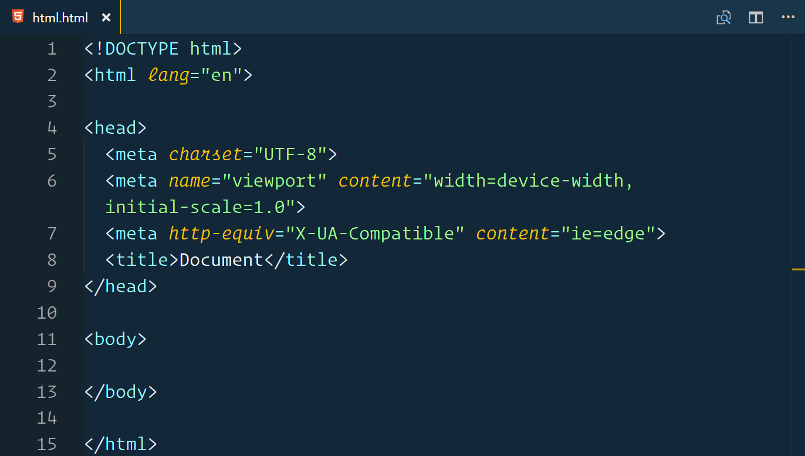

## JAVASCRIPT

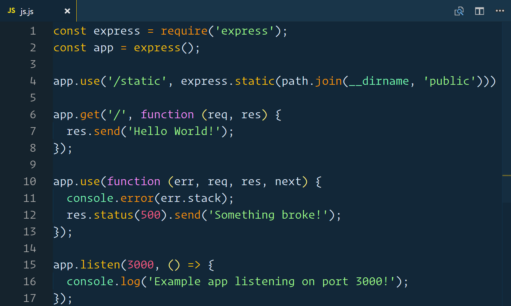

## JSON

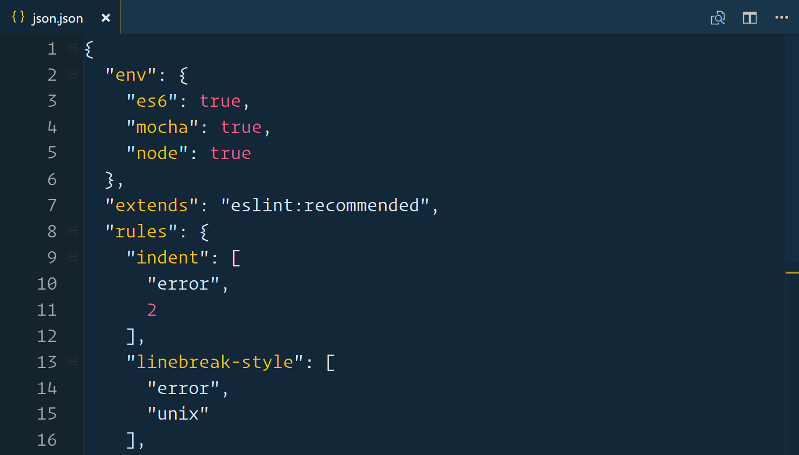

## MARKDOWN

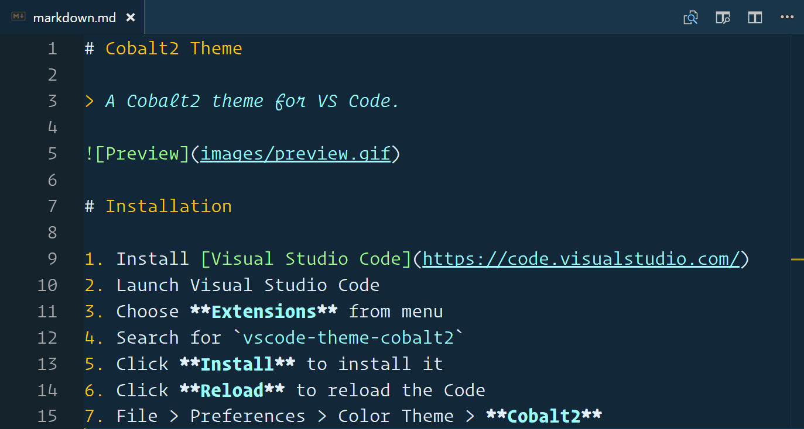

## PROPERTIES

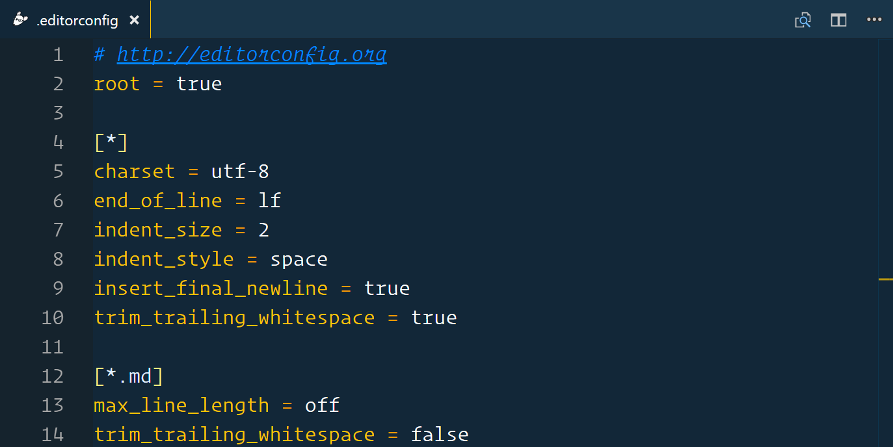

## PUG


## PYTHON

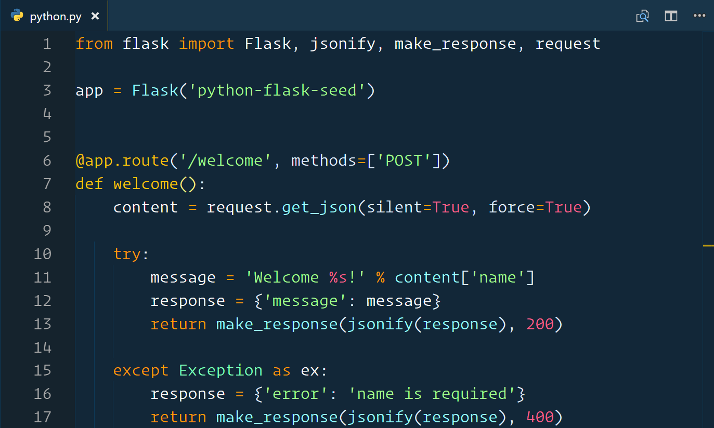

## TYPESCRIPT

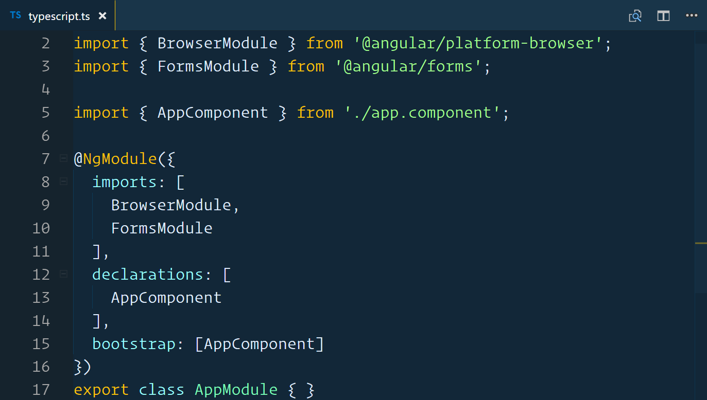

## YAML

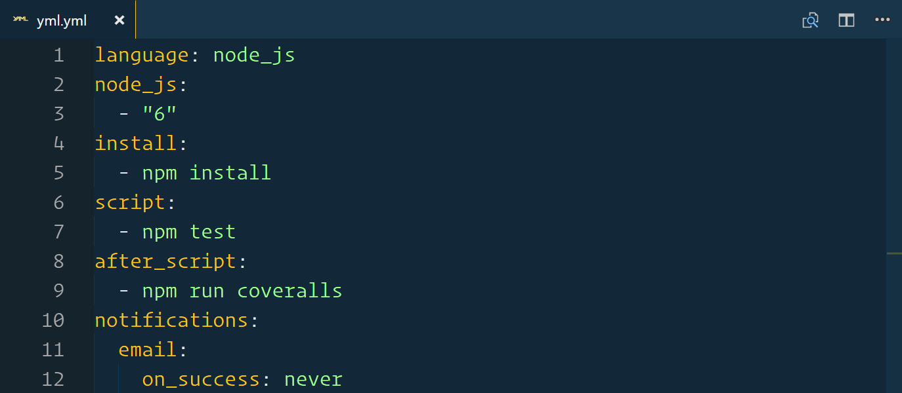

# Development

## Install dependencies

1. Install [Node.js](https://nodejs.org/) and [npm](https://www.npmjs.com/)
2. Install [Visual Studio Code](https://code.visualstudio.com/)

## Run

Clone the repo

```bash
$ git clone https://github.com/robertoachar/vscode-theme-cobalt2.git
```

Install vsce

```bash
$ npm install -g vsce
```

Build the extension file

```bash
$ vsce package

# or

$ npm run build
```

Install the extension from a package file (.vsix)

1. Launch Visual Studio Code
2. Choose **Extensions** from menu
3. Click **More** > **Install from VSIX...**
4. Select the file `vscode-theme-cobalt2-x.x.x.vsix`
6. Click **Reload Now** to reload the Code

## Publish

Create a publisher

```bash
$ vsce create-publisher <publisher-name>
```

Login

```bash
$ vsce login <publisher-name>
```

Publish

```bash
$ vsce publish
```

For more detailed information about publishing extensions: [Publishing Extensions](https://code.visualstudio.com/docs/extensions/publish-extension).

# Contributing


# Author

[Roberto Achar](https://twitter.com/RobertoAchar)

# License

[MIT](https://github.com/robertoachar/vscode-theme-cobalt2/blob/master/LICENSE)
